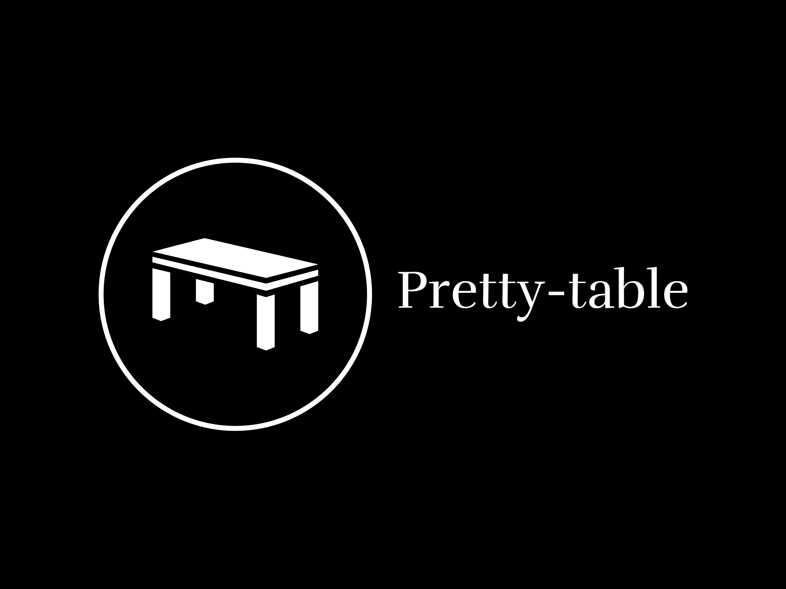

<div align="center">
  
</div>

**Pretty Table** is a Rust crate designed to make your life easier when it comes to formatting and displaying 2-D vectors in a visually appealing tabular format. Whether you're working with strings, numbers, or custom types that implement the `Into<String>` trait, Pretty Table has got you covered.

## Features

- **Versatile Input:** Works with any type that implements the `Into<String>` trait.

- **Beautiful Output:** Transform your 2-D vectors into visually pleasing tables.

- **Console and File Output:** Display your tables in the console or write them to a file effortlessly.

## Installation

Add Pretty Table to your `Cargo.toml` file:

```toml
[dependencies]
pretty-table = "0.1.0"
```

Or, run the command at the root of your project

```shell
cargo add pretty-table
```

## Usage

Consider this quick example to get started.

```rust
use pretty_table::Table;

fn main() {
    let data: Vec<Vec<&str>> = vec![
        vec!["Name", "Age", "Country"],
        vec!["Alice", "25", "Wonderland"],
        vec!["Bob", "30", "Bobland"],
    ];

    let table = Table::from(data);
    table.print();
}
```

Explore more examples at `/examples` directory in this repository.

## Documentation
For more in-depth information, check out the documentation.

## Contribution
We welcome contributions! If you have any ideas, bug fixes, or improvements, feel free to open an issue or submit a pull request.

## License
This project is licensed under the MIT License.